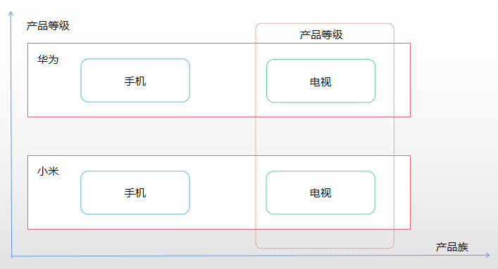

## 1. 抽象工厂模式定义
>Q:为什么需要抽象工厂模式？
>
>A:工厂方法模式是为了生产一类“产品”出现的，当需要创建另一品类时，当前工厂就不适用，需要增加新的一组抽象工厂和具体工厂

产品族和产品等级的概念说明，横向表示一个产品族，纵向表示一个产品等级，如下图：

抽象工厂（AbstractFactory）模式的定义：是一种为访问类提供一个创建一组相关或相互依赖对象的接口，且访问类无须指定所要产品的具体类就能得到
同族的不同等级的产品的模式结构。

## 2. 优缺点
* 优点
    1. 一个具体工厂就可以创建一个产品族中的多个产品，而不必像工厂方法模式一样引入多个工厂类才能够实现
    2. 增加新的产品族时，无须修改原有代码，满足开闭原则
* 缺点
    1.
## 3. 使用场景
产品有多个产品族，且一个产品族中包含多个产品等级时可以使用抽象工厂模式进行创建
抽象工厂一般需要如下几个角色：
1. 抽象工厂：负责规范具体工厂的行为，定义创建不同产品等级方法
2. 具体工厂: 负责具体产品的创建工作
3. 抽象产品：负责规范需要创建的产品品类
4. 具体产品：需要创建的具体产品